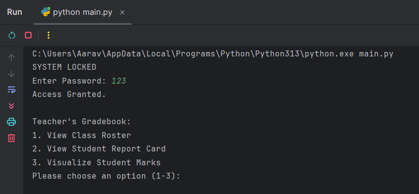
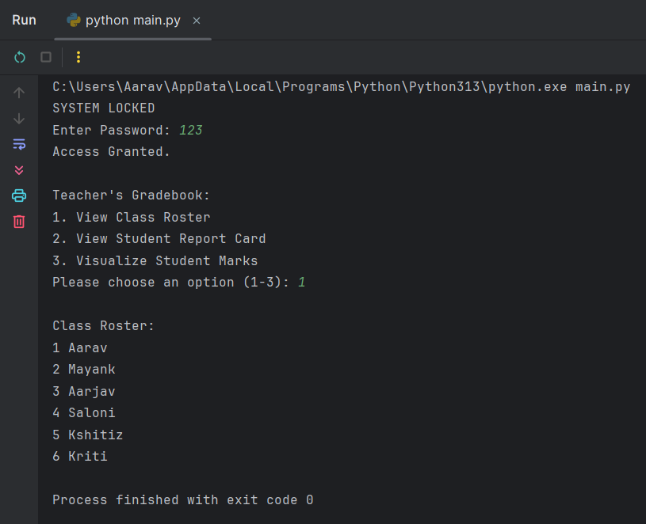
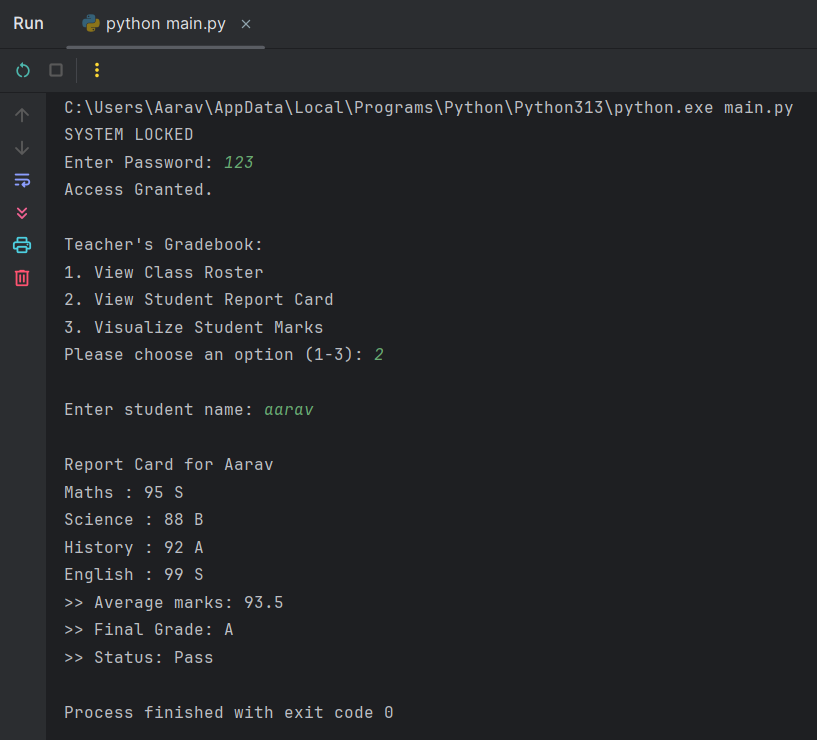
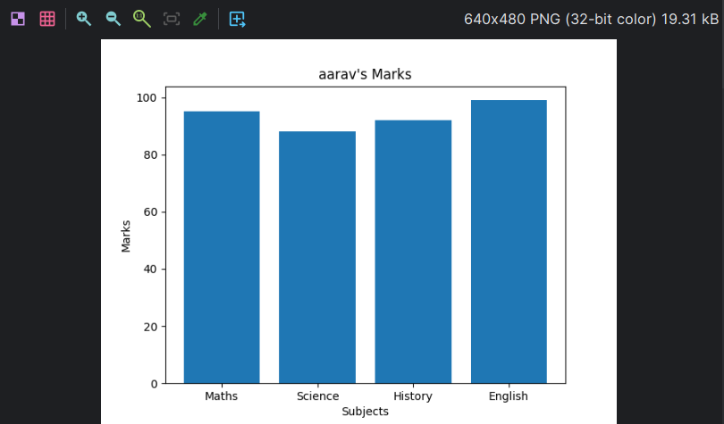

# Project: Teacher's Gradebook

## Project Overview
This is a simple tool designed to help teachers manage student records efficiently. It automates the calculation of grades, generates report cards, and provides a visual graph for analysis.

This tool allows teachers to view class rosters, analyze individual student performance, and visualize subject marks.

## Features
* **Secure Login:** Password-protected access to ensure only teachers can view grades.
* **Class Roster:** Displays a list of all students in the class.
* **Report Card:** Provides Total Marks, Average, and Grade (S to F) for any student.
* **Data Visualization:** Generates a Bar Chart of student marks using `matplotlib`.
* **Pass/Fail:** Automatically determines the pass/fail status based on the calculated average.

## File Structure
```
vityarthi_project/           # Project Directory
│
├── img/                     # Contains screenshots       
│   ├── graph.png     
│   ├── menu.png         
│   ├── report.png        
│   └── roster.png        
│
├── data.py                  # Contains student data
├── main.py                  # Main program file
├── README.md                # Project Documentation
├── reportfile.pdf           # Project Report File (PDF)        
├── reports.py               # Contains report card function
├── roster.py                # Contains class roster function
├── statement.md             # Project Statement
└── visualize.py             # Contains bar graph function
```
## Technologies/Tools Used
* **Python3**: Programming Language
* **PyCharm**: Code Editor
* **Git, GitHub and GitKraken**: Version Control
* **matplotlib**: Module for Data Visualization

## Steps to Install and Run the Project
Follow these steps to run the project in your terminal:

1. **Clone the Repository**:
   ```
   git clone https://github.com/Aim2339/vityarthi_project.git
   ```
2. **Install Required Library**:
   ```
   pip install matplotlib
   ```
3. **Run the Application**: 
   ```
   python main.py
   ```

## How to Use
1. **Login**: When the program starts, enter the password ``123``.
2. **Menu Selection**: Choose an option from the menu:
   1. View the list of all students.
   2. Generate a Report Card for a specific student.
   3. Generate a Bar Graph of marks for a specific student.
3. **Input**: Enter the Student Name when prompted (Aarav)

## Screenshots
1. **Main Menu and Login**:
 

2. **Class Roster**:
 

3. **Report Card**:
 

4. **Bar Graph**:
 

## Report File:
[Report File](reportfile.pdf)